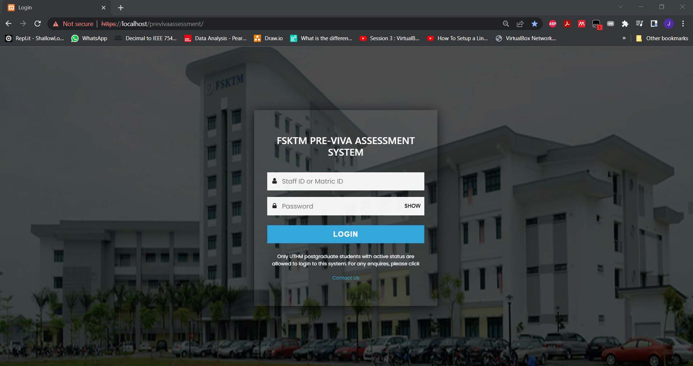
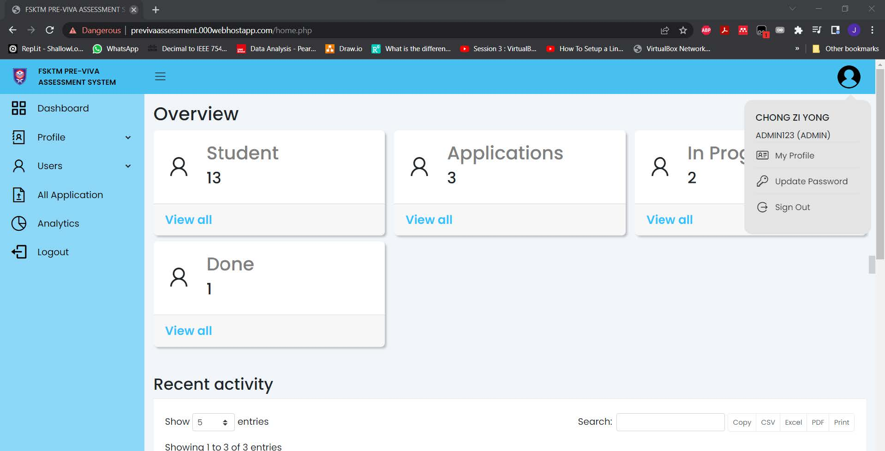
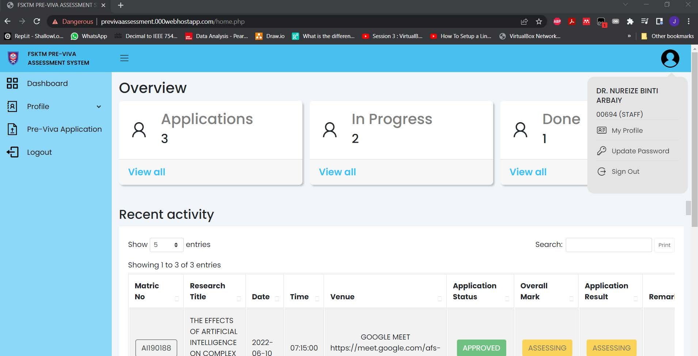
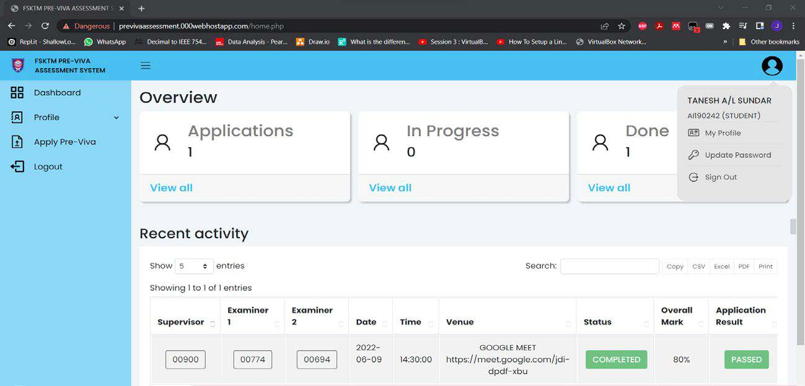
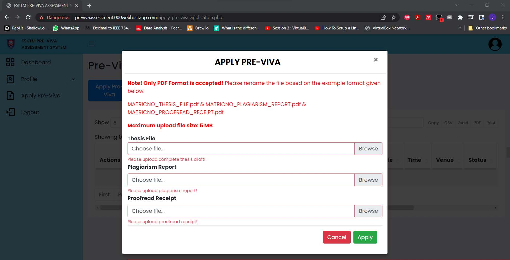
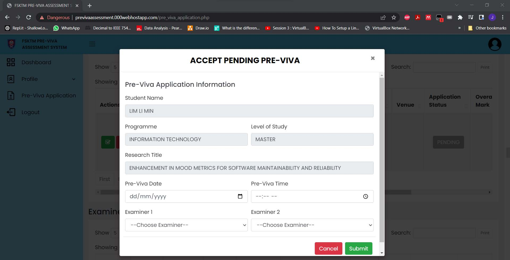
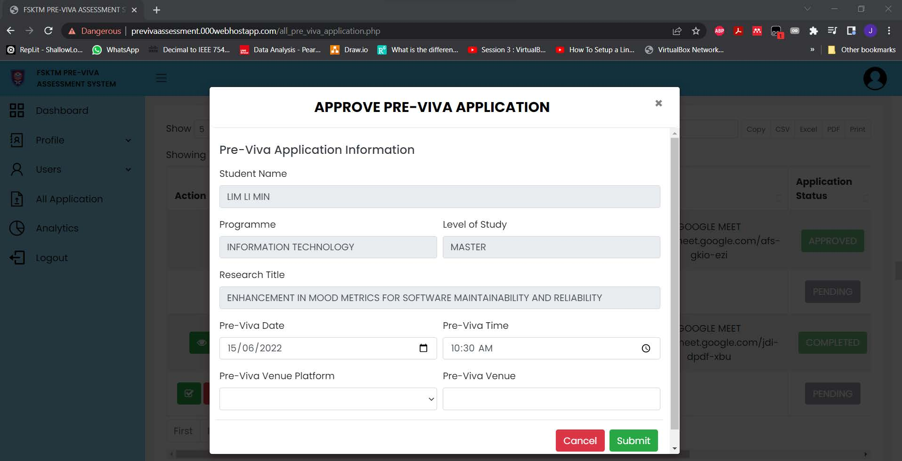
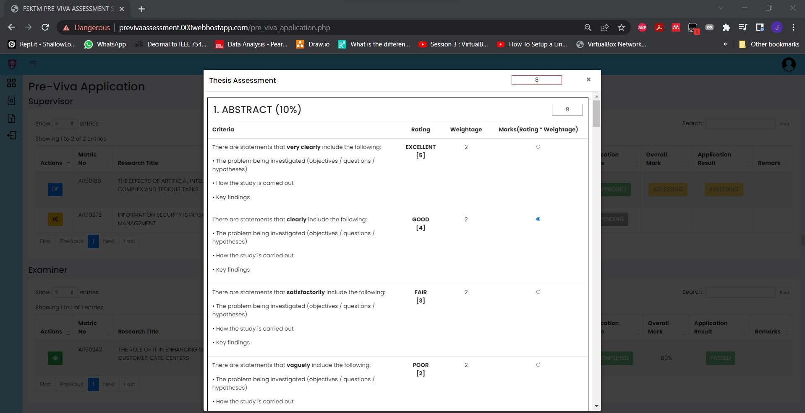
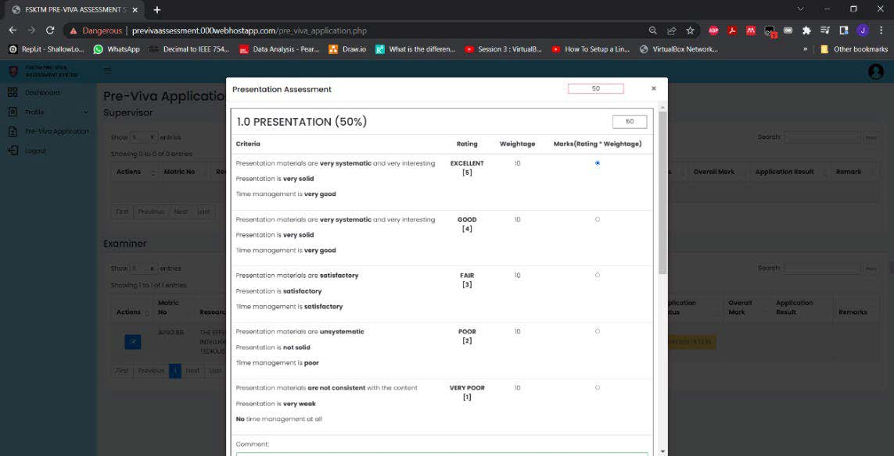
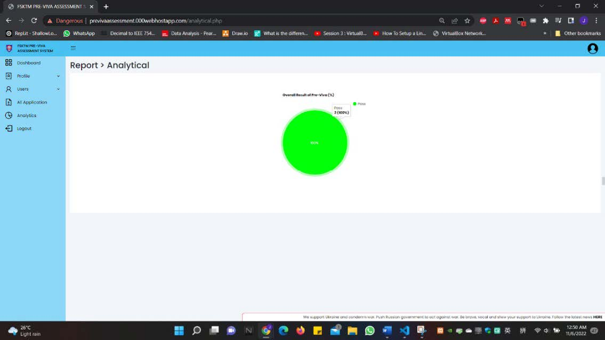

# FSKTM PRE-VIVA ASSESSMENT SYSTEM
Welcome to the UTHM Faculty of Computer Science and Information Technology (FSKTM) Pre-Viva Assessment System! Our platform is meticulously crafted to facilitate the pre-viva assessment process for postgraduates.

## System Demo
[Demo](https://drive.google.com/file/d/1nPAdNjKgpQ7MJ_Vo3TIr4zGQrFi3Rc_8/view?usp=sharing)

## System Images













## Table of Contents
- [FSKTM PRE-VIVA ASSESSMENT SYSTEM](#fsktm-pre-viva-assessment-system)
- [Introduction](#introduction)
- [Setup Instructions](#setup-instructions)
  - [Requirements](#requirements)
  - [Installation & Setup Steps](#installation--setup-steps)
    - [1. Download XAMPP](#1-download-xampp)
    - [2. Start Apache and MySQL Servers](#2-start-apache-and-mysql-servers)
    - [3. Create Database & Tables](#3-create-database--tables)
      - [Option A - Create database and tables using phpMyAdmin](#option-a---create-database-and-tables-using-phpmyadmin)
      - [Option B - Create database and tables using command prompt](#option-b---create-database-and-tables-using-command-prompt)
    - [4. Download Project Source Code & Unzip](#4-download-project-source-code--unzip)
    - [5. Access the Website](#5-access-the-website)
- [Remarks](#remarks)

## Introduction
This system functions as a professional tool for conducting pre-viva assessments, offering comprehensive functionalities for managing assessment criteria, rating student presentations, and generating detailed reports. 
It has been meticulously crafted with PHP and MySQL to ensure efficiency and reliability in the assessment process.

## Setup Instructions
### Requirements
• PHP (version >= 7.0)

• MySQL

• Web server (e.g., Apache, XAMPP, 000WebHost)

### Installation & Setup Steps
#### 1. Download XAMPP:
• Visit the official [XAMPP website](https://www.apachefriends.org/).

• Download the appropriate version of XAMPP for your operating system (Windows, macOS, Linux).

#### 2. Start Apache and MySQL Servers:
• Once XAMPP is installed, launch the XAMPP Control Panel.

• Start the Apache and MySQL servers by clicking on the "Start" button next to each service.

#### 3. Create Database & Tables:
##### Option A - Create database and tables using phpMyAdmin:
• Open your web browser and navigate to http://localhost:80/phpmyadmin OR http://localhost:8080/phpmyadmin (Depends on the XAMPP Apache port).

• Navigate to the Databases tab and fill in the "Database name" then click "Create" button.

• Import the database schema from the database.sql file provided in the repository. 

##### Option B - Create database and tables using command prompt:
• To log in to MySQL from the command line, if you haven't set a password, the default root password should be empty.
```
mysql -u root -p
```

• Create the database and name it to "pre_viva_assessment" 
```
CREATE DATABASE IF NOT EXISTS pre_viva_assessment;
```

• Use the database. 
```
USE pre_viva_assessment;
```

• Create the following tables with the SQL scripts.
Users Table
```
CREATE TABLE tbl_user (
    user_id CHAR(10) PRIMARY KEY,
    name VARCHAR(255),
    email VARCHAR(255),
    phone_no CHAR(20),
    ic CHAR(15),
    passport CHAR(15),
    sex CHAR(6),
    race CHAR(8),
    religion CHAR(20),
    nationality CHAR(70),
    country CHAR(70),
    register_status BOOLEAN,
    password VARCHAR(255),
    user_type CHAR(8)
);
```
Staff Table
```
CREATE TABLE tbl_staff (
    staff_id INT(8) AUTO_INCREMENT PRIMARY KEY,
    user_id CHAR(10),
    faculty VARCHAR(255),
    designation VARCHAR(255),
    field_category VARCHAR(100),
    field VARCHAR(100),
    FOREIGN KEY (user_id) REFERENCES tbl_user(user_id) ON DELETE CASCADE ON UPDATE CASCADE
);
```
Student Table
```
CREATE TABLE tbl_student (
    student_id INT(8) AUTO_INCREMENT PRIMARY KEY,
    user_id CHAR(10),
    faculty VARCHAR(255),
    Level_of_study VARCHAR(50),
    programme VARCHAR(100),
    research_title VARCHAR(100),
    FOREIGN KEY (user_id) REFERENCES tbl_user(user_id) ON DELETE CASCADE ON UPDATE CASCADE
);
```
Application Table
```
CREATE TABLE tbl_application (
    application_id INT(8) AUTO_INCREMENT PRIMARY KEY,
    student_id INT(8),
    thesis_file VARCHAR(255),
    plagiarism VARCHAR(255),
    proofread VARCHAR(255),
    pre_viva_date DATE,
    pre_viva_time TIME,
    pre_viva_venue VARCHAR(255),
    pre_viva_venue_platform VARCHAR(255),
    application_status VARCHAR(50),
    overall_mark INT(8),
    application_result BOOLEAN,
    remark TEXT,
    FOREIGN KEY (student_id) REFERENCES tbl_student(student_id) ON DELETE CASCADE ON UPDATE CASCADE
);
```
Supervisor Table
```
CREATE TABLE tbl_supervisor (
    supervisor_id INT(8) AUTO_INCREMENT PRIMARY KEY,
    user_id CHAR(10),
    student_id INT(8),
    FOREIGN KEY (user_id) REFERENCES tbl_user(user_id) ON DELETE CASCADE ON UPDATE CASCADE,
    FOREIGN KEY (student_id) REFERENCES tbl_student(student_id) ON DELETE CASCADE ON UPDATE CASCADE
);
```
Examiner Table
```
CREATE TABLE tbl_examiner (
    examiner_id INT(8) AUTO_INCREMENT PRIMARY KEY,
    user_id CHAR(10),
    application_id INT(8),
    examiner_status BOOLEAN,
    remark TEXT,
    FOREIGN KEY (user_id) REFERENCES tbl_user(user_id) ON DELETE CASCADE ON UPDATE CASCADE,
    FOREIGN KEY (application_id) REFERENCES tbl_application(application_id) ON DELETE CASCADE ON UPDATE CASCADE
);
```
Thesis Comment Table
```
CREATE TABLE tbl_thesis_comment (
    comment_id INT(8) AUTO_INCREMENT PRIMARY KEY,
    application_id INT(8),
    user_id CHAR(10),
    abstract TEXT,
    introduction TEXT,
    literature_review TEXT,
    research_methodology TEXT,
    result_discussion TEXT,
    conclusion_recommendation TEXT,
    reference TEXT,
    writing_format TEXT,
    commented_version VARCHAR(255),
    FOREIGN KEY (application_id) REFERENCES tbl_application(application_id) ON DELETE CASCADE ON UPDATE CASCADE,
    FOREIGN KEY (user_id) REFERENCES tbl_user(user_id) ON DELETE CASCADE ON UPDATE CASCADE
);
```
Thesis Result Table
```
CREATE TABLE tbl_thesis_result (
    result_id INT(8) AUTO_INCREMENT PRIMARY KEY,
    application_id INT(8),
    user_id CHAR(10),
    abstract_mark INT,
    introduction_mark INT,
    literature_review_mark INT,
    research_methodology_mark INT,
    result_discussion_mark INT,
    conclusion_recommendation_mark INT,
    reference_mark INT,
    writing_format_mark INT,
    FOREIGN KEY (application_id) REFERENCES tbl_application(application_id) ON DELETE CASCADE ON UPDATE CASCADE,
    FOREIGN KEY (user_id) REFERENCES tbl_user(user_id) ON DELETE CASCADE ON UPDATE CASCADE
);
```
Presentation Comment Table
```
CREATE TABLE tbl_presentation_comment (
    present_comment_id INT(8) AUTO_INCREMENT PRIMARY KEY,
    application_id INT(8),
    user_id CHAR(10),
    presentation TEXT,
    QNA TEXT,
    FOREIGN KEY (application_id) REFERENCES tbl_application(application_id) ON DELETE CASCADE ON UPDATE CASCADE,
    FOREIGN KEY (user_id) REFERENCES tbl_user(user_id) ON DELETE CASCADE ON UPDATE CASCADE
);
```
Presentation Result Table
```
CREATE TABLE tbl_presentation_result (
    present_result_id INT(8) AUTO_INCREMENT PRIMARY KEY,
    application_id INT(8),
    user_id CHAR(10),
    presentation_mark INT,
    QNA_mark INT,
    FOREIGN KEY (application_id) REFERENCES tbl_application(application_id) ON DELETE CASCADE ON UPDATE CASCADE,
    FOREIGN KEY (user_id) REFERENCES tbl_user(user_id) ON DELETE CASCADE ON UPDATE CASCADE
);
```

#### 4. Download Project Source Code & Unzip:
• Download and unzip the source code folder. Copy the folder and paste it into the "htdocs" directory located in the XAMPP installation directory (e.g., C:\xampp\htdocs\ on Windows).

#### 5. Access the Website: 
• Open your web browser and navigate to http://localhost/website_folder_name/, replacing "website_folder_name" with the name of the folder containing the website files.
(http://localhost/website_folder_name - Port:80, http://localhost:8080/website_folder_name - Port:8080)

> [!NOTE]
> #### Run the first_time_login.php before start using the system
> •  Run http://localhost/website_folder_name/first_time_login.php to initialize the Admin user data.

> [!IMPORTANT]
> #### Update CONSTANT PROTOCOL inside the "dbh.inc.php" at line 17
> • If you're using localhost, define('PROTOCOL', 'http'). If you're using a live hosting server, define('PROTOCOL', 'https')
>
> #### Update $path inside the "dbh.inc.php" at line 21
>• If Apache Port:80 => $path = str_replace($_SERVER['DOCUMENT_ROOT'], "", $path);
>
> • If Apache Port:8080 => $path = str_replace($_SERVER['DOCUMENT_ROOT'], ":8080", $path);
